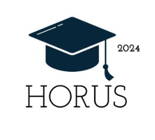

# Horus - 1º Semestre

  <strong>API 1</strong> • <strong>1º Semestre</strong> • <strong>2024-1</strong> • 
  <a href="https://fatecsjc-prd.azurewebsites.net/">
    FATEC São José dos Campos - Prof. Jessen Vidal
  </a>

  

  <a href="https://github.com/m-germano/projetoAPI-horus">
    Repositório do Projeto
  </a>

  <strong>Papel exercido no projeto:</strong> Product Owner e Desenvolvedor

---

## Parceiro acadêmico

| Item | Descrição |
|---|---|
| Parceiro acadêmico | [FATEC São José dos Campos - Prof. Jessen Vidal](https://fatecsjc-prd.azurewebsites.net/) |
| Contexto | Projeto acadêmico desenvolvido no 1º semestre do curso de Análise e Desenvolvimento de Sistemas |
| Equipe | Grupo Horus |
| Produto | Horus |

---

## Sumário

- [Identificação do projeto](#identificação-do-projeto)
- [Parceiro acadêmico](#parceiro-acadêmico)
- [Problema proposto](#problema-proposto)
- [Solução desenvolvida](#solução-desenvolvida)
- [Tecnologias utilizadas](#tecnologias-utilizadas)
- [Minhas contribuições](#minhas-contribuições)
- [Hard skills](#hard-skills)
- [Soft skills](#soft-skills)
- [Navegação do portfólio](#navegação-do-portfólio)

---

## Problema proposto

Estudantes e usuários iniciantes costumam ter dificuldade para compreender a Metodologia Ágil, especialmente quando estão tendo o primeiro contato com Scrum e seus principais artefatos, eventos e práticas.
Os conceitos de Product Backlog, Sprint, Sprint Planning, Sprint Review, Daily, Retrospective, DoR, DoD, Planning Poker, Kanban e MVP podem ficar dispersos ou ser apresentados de forma pouco acessível para quem ainda não conhece o assunto.
Sem uma forma de avaliação, torna-se difícil identificar se o conteúdo apresentado foi realmente compreendido pelo usuário.
Além disso, sem coleta de feedback, não há retorno estruturado sobre a experiência de navegação, a clareza dos conteúdos e os pontos que poderiam ser melhorados.

---

## Solução desenvolvida

A equipe desenvolveu uma aplicação web no formato de site educacional sobre Scrum e Metodologia Ágil.
O sistema foi estruturado com páginas de conteúdo para apresentar os principais conceitos de forma simples, organizada e acessível.
Também foram incluídas avaliações de conhecimento para apoiar a verificação da aprendizagem dos usuários.
A solução contou com coleta de feedbacks sobre a experiência e os conteúdos apresentados.
Além disso, foi criada uma área administrativa para consulta dos registros gerados pelas avaliações e feedbacks.

---

## Tecnologias utilizadas

| Tecnologia | Aplicação no projeto |
|---|---|
| HTML | Estruturação das páginas de conteúdo, avaliação, feedback e área administrativa |
| CSS | Estilização visual das páginas e ajustes de layout |
| JavaScript | Apoio à interatividade da interface do site educacional |
| Bootstrap | Padronização visual, componentes de interface e responsividade |
| Python | Linguagem utilizada no backend da aplicação web |
| Flask | Framework utilizado para criação das rotas e integração das páginas |
| Flask-SQLAlchemy | Persistência e consulta dos dados gerados pela aplicação |
| Flask-Login | Controle de autenticação para acesso à área administrativa |
| Flask-Bcrypt | Tratamento seguro de senhas no fluxo de autenticação |
| Git e GitHub | Versionamento, organização e publicação do repositório |
| Scrum | Organização do trabalho em equipe durante as sprints |

---

## Minhas contribuições

Atuei como Product Owner e Desenvolvedor no projeto Horus.
Minha participação combinou atividades de alinhamento com o cliente/professor responsável, organização dos requisitos e acompanhamento das entregas.
Como Product Owner, ajudei a priorizar o que deveria compor o MVP do site educacional e acompanhei a evolução das sprints.
Também apoiei a comunicação do time, ajudando a transformar a necessidade de ensinar Scrum em páginas, avaliações e feedbacks.
Como Desenvolvedor, contribuí com a estruturação de páginas, organização dos conteúdos e apoio em funcionalidades ligadas à avaliação, feedback e área administrativa.

### Contribuições como Product Owner

Como Product Owner, minha atuação foi voltada para aproximar o projeto das necessidades do cliente/professor responsável e manter a equipe alinhada com a proposta do desafio. O trabalho não se limitou ao desenvolvimento técnico, pois também envolveu a organização dos requisitos, definição de prioridades e acompanhamento das entregas ao longo das sprints.

Durante o projeto, participei da interpretação do problema proposto, ajudei a transformar as necessidades apresentadas em funcionalidades para o sistema e acompanhei se o produto desenvolvido estava de acordo com o objetivo principal: ensinar Metodologia Ágil de forma simples, acessível e funcional.

Também contribuí para a comunicação entre os integrantes da equipe, auxiliando na organização das tarefas, no alinhamento das decisões e na preparação das entregas realizadas durante o semestre.

### Contribuições no desenvolvimento

Além das atividades como Product Owner, também participei do desenvolvimento da aplicação, principalmente na criação e estruturação de páginas do site. Contribuí para a construção da interface, organização dos conteúdos e implementação de partes da aplicação voltadas à apresentação dos conceitos de Metodologia Ágil.

Minha participação técnica também envolveu o contato com tecnologias utilizadas no projeto, como HTML, CSS, Bootstrap, JavaScript, Python e Flask, permitindo aplicar conhecimentos de desenvolvimento web em um projeto prático e desenvolvido em equipe.

---

## Hard skills

| Hard skill | Nível de proficiência | Evidência no projeto |
|---|---|---|
| HTML | Faço/uso com autonomia | Estruturação das páginas e organização do conteúdo do site |
| CSS | Faço/uso com autonomia | Estilização e ajustes visuais da interface |
| Bootstrap | Faço/uso com autonomia | Apoio à padronização visual e responsividade das páginas |
| JavaScript | Faço/uso com ajuda | Apoio à interatividade e comportamento da interface |
| Python | Faço/uso com ajuda | Participação no desenvolvimento da aplicação backend |
| Flask | Faço/uso com ajuda | Apoio na construção e integração da aplicação web |
| Flask-SQLAlchemy | Faço/uso com ajuda | Contato com a persistência de dados da aplicação |
| Flask-Login | Faço/uso com ajuda | Apoio ao fluxo de autenticação da área administrativa |
| Flask-Bcrypt | Faço/uso com ajuda | Contato com práticas de segurança no tratamento de senhas |
| Git e GitHub | Faço/uso com autonomia | Versionamento do código e organização do repositório |
| Scrum | Faço/uso com autonomia | Organização das sprints, acompanhamento das entregas e alinhamento com a equipe |
| Product Owner | Faço/uso com autonomia | Levantamento de requisitos, priorização de entregas e comunicação com o cliente/professor responsável |

---

## Soft skills

| Soft skill | Situação em que foi exercitada |
|---|---|
| Comunicação | Atuei no alinhamento com o cliente/professor responsável e repassei ao time as necessidades do site educacional sobre Scrum |
| Organização | Auxiliei na organização dos requisitos, tarefas e prioridades para manter o foco no MVP durante as sprints |
| Protagonismo | Assumi responsabilidades como Product Owner e também participei da estruturação das páginas e conteúdos do sistema |
| Colaboração | Trabalhei com a equipe para transformar os conteúdos de Metodologia Ágil em páginas, avaliações e feedbacks |
| Adaptabilidade | Adaptei-me ao primeiro projeto API, à rotina de sprints e ao uso combinado de tecnologias web no desenvolvimento do Horus |
| Visão de produto | Ajudei a transformar a necessidade de ensinar Scrum em uma aplicação educacional simples, navegável e com retorno dos usuários |

---

## Navegação do portfólio

| 🏠 Página inicial | ⬅️ Projeto anterior | ➡️ Próximo projeto |
|---|---|---|
| [README](../README.md) | — | [API 2](../2Sem/README.md) |

