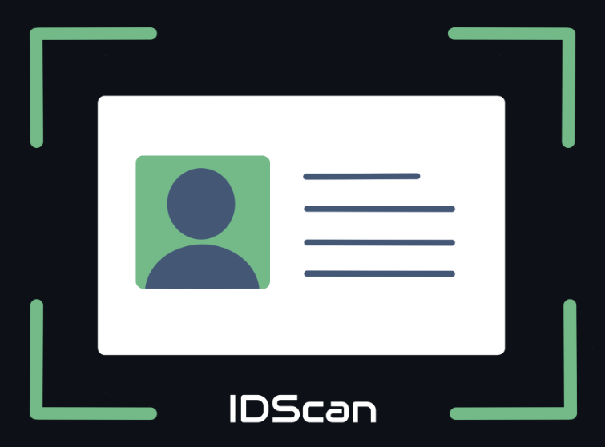

# IDScan - 2º Semestre

  <strong>2º semestre de 2024</strong> • 
  <a href="https://fatecsjc-prd.azurewebsites.net/">
    FATEC São José dos Campos - Prof. Jessen Vidal
  </a>

  

  <a href="https://github.com/Titus-System/2semestre-ADS">
    Repositório do Projeto
  </a>

  <strong>Papel exercido no projeto:</strong> Desenvolvedor

---

## Sumário

- [Problema proposto](#problema-proposto)
- [Solução desenvolvida](#solução-desenvolvida)
- [Tecnologias utilizadas](#tecnologias-utilizadas)
- [Minhas contribuições](#minhas-contribuições)
- [Hard skills](#hard-skills)
- [Soft skills](#soft-skills)
- [Navegação do portfólio](#navegação-do-portfólio)

---

## Problema proposto

O desafio consistia em desenvolver uma aplicação desktop em Java capaz de extrair informações de imagens de documentos e armazená-las em um banco de dados local. A proposta envolvia o uso de processamento de imagem e inteligência artificial para automatizar a leitura de documentos físicos.

A equipe escolheu trabalhar com documentos de identidade, mais especificamente o RG, com o objetivo de identificar e organizar informações relevantes presentes na imagem, como dados pessoais do documento, sem depender de APIs externas.

---

## Solução desenvolvida

A solução desenvolvida foi o IDScan, um aplicativo Java Desktop voltado ao processamento de imagens de documentos de identidade. O sistema realiza a leitura da imagem do RG, extrai o texto presente no documento e organiza os dados identificados para posterior armazenamento e edição em um banco de dados MySQL local.

Todas as operações do aplicativo foram pensadas para funcionar localmente, desde o processamento das informações até a persistência dos dados. Para melhorar a precisão e o desempenho, a equipe optou por utilizar o Tesseract OCR para extrair o texto bruto da imagem e um modelo de linguagem executado localmente com Ollama para identificar os dados relevantes dentro do texto extraído.

---

## Tecnologias utilizadas

| Tecnologia | Aplicação no projeto |
|---|---|
| Java | Linguagem utilizada para desenvolvimento da aplicação desktop |
| MySQL | Banco de dados relacional utilizado para armazenamento local das informações |
| Ollama | Execução local de modelos de linguagem e apoio à interpretação dos dados extraídos |
| Tesseract OCR | Reconhecimento óptico de caracteres para leitura do texto presente nos documentos |
| Git e GitHub | Versionamento do código e organização do repositório |
| Jira | Gerenciamento das tarefas e acompanhamento das sprints |
| VS Code | Ambiente utilizado como apoio ao desenvolvimento |
| Figma | Criação e visualização prévia do design das telas |

---

## Minhas contribuições

Neste projeto, atuei como integrante do time de desenvolvimento, contribuindo principalmente com pesquisas, testes de modelos de inteligência artificial e construção de consultas para o banco de dados MySQL. Minha participação foi voltada tanto para a investigação técnica da melhor abordagem para extração de dados quanto para o apoio na persistência das informações tratadas pela aplicação.

### Testes com modelos de inteligência artificial

Durante a primeira sprint, fiquei responsável por testar modelos de inteligência artificial visuais que pudessem auxiliar na extração de informações a partir das imagens dos documentos. Entre os modelos avaliados estavam o `MiniCPM-V` e o `LLaVA`, ambos executados localmente com o apoio do Ollama.

Essa etapa foi importante para entender as limitações e possibilidades do uso de modelos visuais no projeto. Durante os testes, adquiri maior conhecimento sobre integração com o Ollama, execução local de modelos de IA e construção de prompts voltados à extração de informações estruturadas.

Ao longo da sprint, a equipe identificou que utilizar apenas modelos visuais poderia gerar respostas menos previsíveis e exigir mais desempenho da máquina. Por isso, o grupo decidiu adotar uma abordagem híbrida, utilizando o Tesseract OCR para extrair o texto bruto da imagem e um modelo de linguagem para localizar, interpretar e estruturar os dados necessários dentro desse texto.

Essa decisão tornou o processo mais rápido, mais preciso e mais viável para execução em hardwares mais simples, mantendo a proposta de realizar todas as operações localmente.

### Contribuições no banco de dados

Na segunda e terceira sprint, minha participação foi mais direcionada à criação de queries SQL para o banco de dados MySQL. Contribuí na construção de comandos voltados ao armazenamento, consulta e manipulação dos dados extraídos dos documentos.

Essa atuação ajudou na organização das informações dentro do banco relacional, permitindo que os dados processados pela aplicação fossem persistidos e posteriormente consultados ou editados pelo usuário.

### Contribuições gerais no desenvolvimento

Além das atividades específicas com IA e banco de dados, também acompanhei o desenvolvimento da aplicação desktop, colaborando com decisões técnicas da equipe e com a adaptação da solução conforme os testes realizados durante as sprints.

O projeto foi importante para ampliar meu contato com aplicações Java Desktop, integração com ferramentas locais de inteligência artificial, OCR e persistência de dados em banco relacional.

---

## Hard skills

| Hard skill | Nível de proficiência | Evidência no projeto |
|---|---|---|
| Java | Sei fazer com apoio | Participação no desenvolvimento da aplicação desktop |
| MySQL | Sei fazer com autonomia | Criação de queries para armazenamento, consulta e manipulação dos dados |
| SQL | Sei fazer com autonomia | Apoio na organização e persistência das informações extraídas dos documentos |
| Ollama | Sei fazer com apoio | Testes e execução local de modelos de inteligência artificial |
| Prompt Engineering | Sei fazer com apoio | Criação de prompts para orientar modelos na extração de informações estruturadas |
| Modelos de IA visuais | Sei fazer com apoio | Testes com modelos como MiniCPM-V e LLaVA durante a primeira sprint |
| Tesseract OCR | Sei fazer com apoio | Compreensão do fluxo de extração de texto bruto a partir das imagens dos documentos |
| Git e GitHub | Sei fazer com autonomia | Versionamento do código e colaboração no repositório |
| Jira | Sei fazer com autonomia | Acompanhamento de tarefas e organização do desenvolvimento por sprint |
| Figma | Sei fazer com apoio | Consulta e apoio na visualização do design planejado para as telas |

---

## Soft skills

| Soft skill | Situação em que foi exercitada |
|---|---|
| Investigação técnica | Pesquisei e testei diferentes modelos de IA para avaliar qual abordagem seria mais adequada ao problema proposto |
| Pensamento crítico | Analisei, junto com a equipe, as limitações dos modelos visuais e a necessidade de uma solução mais precisa e viável |
| Colaboração | Trabalhei em conjunto com os demais integrantes para adaptar a solução técnica ao longo das sprints |
| Adaptabilidade | Precisei mudar o foco inicial dos testes com modelos visuais para uma abordagem híbrida com OCR e modelo de linguagem |
| Organização | Apoiei o desenvolvimento com queries e estruturação dos dados utilizados pela aplicação |
| Aprendizado contínuo | Desenvolvi novos conhecimentos sobre Ollama, OCR, modelos de IA locais e integração dessas ferramentas em uma aplicação |

---

## Navegação do portfólio

| 🏠 Página inicial | ⬅️ Projeto anterior | ➡️ Próximo projeto |
|---|---|---|
| [README](../README.md) | [API 1](../1Sem/README.md) | [API 3](../3Sem/README.md) |

