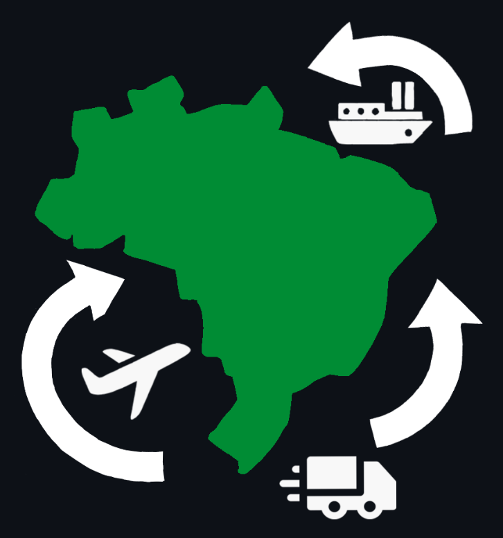

# InsightFlow - 3º Semestre

  <strong>API 3</strong> • <strong>3º Semestre</strong> • <strong>2025-1</strong> • 
  <a href="https://www.domrock.net/">
    Dom Rock
  </a>

  

  <a href="https://github.com/Titus-System/InsightFlow">
    Repositório do Projeto
  </a>

  <strong>Papel exercido no projeto:</strong> Desenvolvedor Backend

---

## Cliente e parceiro acadêmico

| Item | Descrição |
|---|---|
| Cliente | [Dom Rock](https://www.domrock.net/) |
| Área de atuação | Tecnologia, dados, inteligência artificial e soluções para análise de informações |
| Representante | Felipe Santos |
| Parceiro acadêmico | [FATEC São José dos Campos - Prof. Jessen Vidal](https://fatecsjc-prd.azurewebsites.net/) |
| Equipe | Titus Systems |
| Produto | InsightFlow |

---

## Sumário

- [Identificação do projeto](#identificação-do-projeto)
- [Cliente e parceiro acadêmico](#cliente-e-parceiro-acadêmico)
- [Problema proposto](#problema-proposto)
- [Solução desenvolvida](#solução-desenvolvida)
- [Tecnologias utilizadas](#tecnologias-utilizadas)
- [Minhas contribuições](#minhas-contribuições)
- [Hard skills](#hard-skills)
- [Soft skills](#soft-skills)
- [Navegação do portfólio](#navegação-do-portfólio)

---

## Problema proposto

O comércio exterior brasileiro gera um grande volume de dados públicos sobre importações e exportações, distribuídos em bases extensas e com muitos recortes de análise.
Esses dados podem ser complexos para usuários sem domínio técnico em tratamento, organização e consulta de informações.
Análises manuais exigem manipulação de planilhas, filtragem de registros e interpretação de bases amplas, o que dificulta a identificação de padrões.
Havia dificuldade para reconhecer estados e municípios em ascensão, estagnação ou declínio no mercado internacional.
Também era necessário apoiar decisões com indicadores compreensíveis, visuais e acessíveis para diferentes perfis de usuário.

---

## Solução desenvolvida

A equipe desenvolveu o InsightFlow, uma plataforma web voltada à análise de dados de comércio exterior brasileiro.
O sistema permite visualizar importações e exportações por meio de gráficos, rankings e painéis de indicadores.
A aplicação oferece filtros por estado, município, produto, NCM, SH4, país e setor econômico.
Também foram desenvolvidas análises estatísticas para apoiar a interpretação dos dados históricos.
Além disso, a plataforma conta com previsão de tendências utilizando SARIMA para apoiar análises futuras com base nas movimentações comerciais.

  
Detalhes da solução

Entre as principais funcionalidades desenvolvidas estão:

- Painel com gráficos interativos de exportações e importações por estado;
- Detalhamento por estado, incluindo ranking de produtos, evolução histórica e balança comercial;
- Busca avançada com filtros personalizados e pesquisa por código NCM;
- Comparação comercial por Valor FOB e Valor Agregado;
- Agrupamento por setores econômicos, como agronegócio, indústria, bens de consumo, mineração, setor florestal e tecnologia;
- Análises estatísticas de regressão linear, volatilidade, taxa de crescimento mensal, sazonalidade e concentração;
- Previsão de tendências utilizando o modelo estatístico SARIMA.

Para a previsão de tendências, a equipe optou pelo uso do modelo SARIMA por se tratar de uma abordagem adequada para séries temporais mensais com tendência e sazonalidade. A solução também utilizou interpolação linear para tratar valores ausentes, permitindo a geração de previsões com até 24 meses de antecedência.

---

## Tecnologias utilizadas

| Tecnologia | Aplicação no projeto |
|---|---|
| Python | Linguagem utilizada no backend e no processamento de dados |
| Flask | Framework utilizado para construção das APIs |
| Pandas | Manipulação, limpeza e análise dos dados de comércio exterior |
| StatsModels | Criação de análises estatísticas e modelos de previsão |
| PostgreSQL | Banco de dados relacional utilizado para armazenamento das informações tratadas |
| TypeScript | Linguagem utilizada no desenvolvimento do frontend |
| React | Construção das interfaces da aplicação web |
| Vite | Ferramenta utilizada para criação e execução do ambiente frontend |
| HTML | Estruturação das páginas da aplicação |
| Tailwind CSS | Estilização da interface |
| Git e GitHub | Versionamento do código e colaboração no repositório |
| Figma | Apoio na prototipação e visualização das telas |
| Jira | Organização das tarefas e acompanhamento das sprints |
| Scrum | Organização do trabalho em equipe durante o desenvolvimento |

---

## Minhas contribuições

Neste projeto, atuei como Desenvolvedor Backend, com foco no tratamento, organização e exposição de dados de comércio exterior.
Na primeira sprint, desenvolvi gráficos e indicadores relacionados ao processo de limpeza das planilhas do Comex Stat.
Esses indicadores exibiam informações como linhas deletadas, registros inválidos e NCMs inválidos.
Na segunda sprint, desenvolvi a API de estados, com endpoints de consulta para dados de importação e exportação por estado brasileiro.
A API retornava rankings, valores absolutos de exportação/importação e dinheiro movimentado.
Na terceira sprint, participei do sistema de previsão chamado pela equipe de “Vidente”, criando ferramentas de análise histórica, rankings e projeções com base em dados comerciais.

### Desenvolvimento de gráficos da limpeza dos dados

Durante a primeira sprint, fui responsável por desenvolver gráficos relacionados ao processo de limpeza das planilhas obtidas a partir do Comex Stat. Como os dados brutos continham muitas linhas inválidas e inconsistências, era necessário apresentar informações sobre o processo de tratamento realizado.

Nessa etapa, desenvolvi recursos para exibir indicadores da limpeza, como quantidade de linhas deletadas, número de registros inválidos e quantidade de NCMs inconsistentes. Essa funcionalidade ajudou a tornar o processo de tratamento dos dados mais transparente e compreensível para os usuários e para a própria equipe.

### Desenvolvimento da API de estados

Na segunda sprint, desenvolvi a API de estados, responsável por retornar dados de comércio exterior relacionados aos estados brasileiros. Como o banco de dados era abastecido a partir das planilhas do Comex Stat, a API possuía foco em operações de consulta.

Essa API permitia obter informações de importação e exportação por estado, incluindo rankings dos estados que mais exportavam, valores absolutos de exportação e importação, volume financeiro movimentado e outros indicadores relevantes para análise comercial.

Essa contribuição foi importante para estruturar parte central do backend, permitindo que o frontend consumisse dados organizados para exibição em gráficos, rankings e painéis da aplicação.

### Participação no sistema de previsão

Na terceira sprint, participei do desenvolvimento do sistema de previsão, chamado pela equipe de “Vidente”. Essa funcionalidade tinha como objetivo utilizar dados históricos de comércio exterior para gerar análises de tendência e apoiar a identificação de possíveis comportamentos futuros.

Durante essa etapa, desenvolvi ferramentas relacionadas à análise histórica e projeção de dados, incluindo:

- SH4 com maior crescimento ou queda histórica;
- NCMs com maior variação histórica no comércio;
- Ranking mensal de SH4 com maiores valores FOB;
- Top NCMs mensais por valor FOB comercial;
- Análise por setor do valor FOB mensal;
- Tendência de valor FOB para códigos SH4;
- Previsão mensal do valor FOB por NCM.

Essas funcionalidades contribuíram para ampliar a capacidade analítica da plataforma, indo além da visualização de dados históricos e permitindo que o sistema também oferecesse apoio à tomada de decisão por meio de previsões e análises estatísticas.

### Contribuições gerais no desenvolvimento

Além das entregas específicas de cada sprint, também participei da integração entre backend, banco de dados e frontend, garantindo que os dados tratados fossem disponibilizados de forma adequada para consumo pela aplicação.

O projeto foi importante para aprofundar meus conhecimentos em desenvolvimento backend, APIs REST, manipulação de grandes volumes de dados, consultas em banco relacional e aplicação de modelos estatísticos em cenários reais de análise de dados.

---

## Hard skills

| Hard skill | Nível de proficiência | Evidência no projeto |
|---|---|---|
| Python | Faço/uso com autonomia | Desenvolvimento de funcionalidades backend e manipulação de dados |
| Flask | Faço/uso com autonomia | Criação de APIs para consulta e exposição dos dados de comércio exterior |
| Pandas | Faço/uso com autonomia | Apoio no tratamento, organização e análise das bases do Comex Stat |
| PostgreSQL | Faço/uso com autonomia | Consulta e estruturação de dados utilizados pela aplicação |
| SQL | Faço/uso com autonomia | Criação de consultas para retorno de indicadores, rankings e filtros |
| APIs REST | Faço/uso com autonomia | Desenvolvimento da API de estados e endpoints para consumo pelo frontend |
| StatsModels | Faço/uso com ajuda | Participação em funcionalidades estatísticas e modelos de previsão |
| Séries temporais | Faço/uso com ajuda | Apoio no desenvolvimento de análises de tendência e previsão com SARIMA |
| React | Faço/uso com ajuda | Integração com o frontend e compreensão do consumo dos dados pela interface |
| TypeScript | Faço/uso com ajuda | Contato com a estrutura frontend utilizada na aplicação |
| Git e GitHub | Faço/uso com autonomia | Versionamento, colaboração e organização do desenvolvimento |
| Jira | Faço/uso com autonomia | Acompanhamento das tarefas e entregas durante as sprints |
| Scrum | Faço/uso com autonomia | Participação no desenvolvimento incremental do projeto ao longo das sprints |

---

## Soft skills

| Soft skill | Situação em que foi exercitada |
|---|---|
| Pensamento analítico | Transformei dados de comércio exterior em indicadores, rankings e análises para apoiar a interpretação dos usuários |
| Resolução de problemas | Lidei com planilhas do Comex Stat contendo linhas inválidas, registros inconsistentes e NCMs inválidos |
| Colaboração | Trabalhei com a equipe para estruturar endpoints da API de estados e disponibilizar dados consumíveis pelo frontend |
| Organização | Estruturei entregas por sprint, principalmente nas APIs, indicadores de limpeza e ferramentas do sistema “Vidente” |
| Adaptabilidade | Adaptei análises estatísticas e consultas backend para formatos compreensíveis e utilizáveis pelo frontend |
| Aprendizado contínuo | Aprofundei conhecimentos em análise de dados, PostgreSQL, APIs REST, séries temporais e previsão com SARIMA |
| Visão técnica | Participei da construção do sistema de previsão, conectando dados históricos, indicadores e projeções para tomada de decisão |

---

## Navegação do portfólio

| 🏠 Página inicial | ⬅️ Projeto anterior | ➡️ Próximo projeto |
|---|---|---|
| [README](../README.md) | [API 2](../2Sem/README.md) | [API 4](../4Sem/README.md) |

