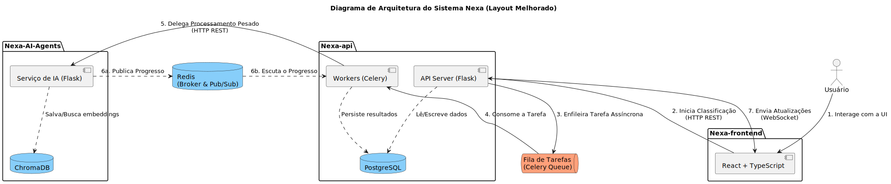
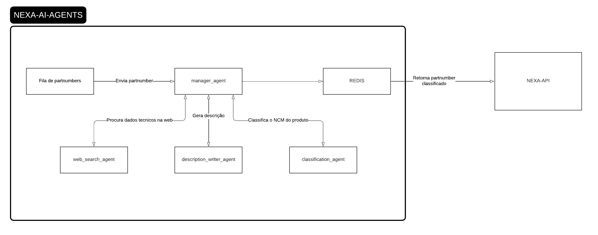

# Nexa - 4º Semestre

  <strong>API 4</strong> • <strong>4º Semestre</strong> • <strong>2025-2</strong>

  

  <a href="https://github.com/Titus-System/Nexa">
    Repositório do Projeto
  </a>

  <strong>Papel exercido no projeto:</strong> Desenvolvedor Backend

---

## Cliente e parceiro acadêmico

| Item | Descrição |
|---|---|
| Cliente | [TecSys Brasil](https://www.tecsysbrasil.com.br/) |
| Área de atuação | Soluções para comércio exterior, tecnologia e processos aduaneiros |
| Representante | Creonice Honório |
| Parceiro acadêmico | [FATEC São José dos Campos - Prof. Jessen Vidal](https://fatecsjc-prd.azurewebsites.net/) |
| Equipe | Titus Systems |
| Produto | Nexa |

---

## Sumário

- [Identificação do projeto](#identificação-do-projeto)
- [Cliente e parceiro acadêmico](#cliente-e-parceiro-acadêmico)
- [Problema proposto](#problema-proposto)
- [Solução desenvolvida](#solução-desenvolvida)
- [Tecnologias utilizadas](#tecnologias-utilizadas)
- [Minhas contribuições](#minhas-contribuições)
- [Hard skills](#hard-skills)
- [Soft skills](#soft-skills)
- [Navegação do portfólio](#navegação-do-portfólio)

---

## Problema proposto

A elaboração da instrução de registro aduaneiro é um processo manual que depende de dados técnicos como Part Number, classificação fiscal, fabricante, origem e endereço do fabricante.
Quando essas informações são interpretadas manualmente, podem ocorrer erros, descrições ambíguas e retrabalho no preparo dos registros.
Inconsistências nos dados ou nas descrições podem resultar em questionamentos, penalidades ou multas durante a análise do processo aduaneiro.
A equipe responsável precisava reduzir o esforço manual e aumentar a segurança das informações enviadas para análise e submissão à Receita Federal.

---

## Solução desenvolvida

A equipe desenvolveu o Nexa, uma aplicação web orientada a eventos para apoiar a geração de instruções de registro aduaneiro.
O projeto foi dividido em três componentes principais: `Nexa-frontend`, `Nexa-api` e `Nexa-AI-Agents`.
A aplicação permite upload de documentos, extração de Part Numbers e processamento das informações com inteligência artificial.
Os agentes de IA apoiam a busca e organização de dados técnicos relacionados aos produtos.
Ao final do fluxo, o sistema gera descrições técnicas para auxiliar a análise e a submissão das informações.

  
Detalhes da arquitetura

A comunicação entre os serviços ocorre por meio de APIs REST, WebSockets e Redis, garantindo maior desacoplamento entre os componentes.

  

### Nexa API

O `Nexa-api` é o orquestrador central da aplicação. Desenvolvido em Python com Flask, ele atua como API Gateway, gerenciando as requisições do frontend, a lógica de negócio principal, a persistência dos dados e a comunicação assíncrona com os demais serviços.

Entre suas responsabilidades estão:

- Exposição de endpoints REST para upload de documentos e classificação de Part Numbers;
- Orquestração assíncrona de tarefas com Celery e Redis;
- Comunicação em tempo real com o frontend utilizando WebSocket;
- Persistência dos resultados em PostgreSQL;
- Validação de dados e controle de autenticação e autorização.

### Nexa AI Agents

O `Nexa-AI-Agents` é o serviço responsável pelas tarefas de inteligência artificial. Ele executa os agentes que buscam informações técnicas, geram descrições humanizadas e apoiam a classificação dos produtos.

Entre suas responsabilidades estão:

- Execução de modelos de linguagem locais;
- Geração de descrições técnicas dos produtos;
- Apoio à classificação de NCMs;
- Uso de RAG com ChromaDB para recuperação de informações contextuais;
- Publicação de atualizações de progresso via Redis Pub/Sub.

  

### Nexa Frontend

O `Nexa-frontend` é a interface web da aplicação. Desenvolvido com React e TypeScript, ele permite que o usuário envie documentos, insira Part Numbers manualmente, acompanhe o progresso das tarefas em tempo real e visualize os resultados gerados pelo sistema.

Entre suas responsabilidades estão:

- Upload de documentos;
- Entrada manual de Part Numbers;
- Exibição dos resultados de classificação;
- Comunicação com a API via HTTP REST;
- Atualização em tempo real por WebSocket.

---

## Tecnologias utilizadas

 

<h4 align="center">Backend, IA e Banco de Dados:</h4>

  

<h4 align="center">Frontend:</h4>

  

<h4 align="center">Infraestrutura e Ferramentas:</h4>

  

 

  
Tecnologias detalhadas

| Tecnologia | Aplicação no projeto |
|---|---|
| Python | Linguagem utilizada no backend e nos agentes de IA |
| Flask | Framework utilizado na construção da API e dos serviços |
| Pytest | Criação e execução de testes automatizados |
| PostgreSQL | Banco de dados relacional utilizado para persistência dos dados |
| SQLAlchemy | ORM utilizado para comunicação com o banco de dados |
| Redis | Broker de mensagens e apoio à comunicação assíncrona |
| Celery | Execução de tarefas assíncronas |
| Socket.IO | Comunicação em tempo real entre backend e frontend |
| Smolagents | Construção e organização dos agentes de IA |
| Ollama | Execução local de modelos de linguagem |
| ChromaDB | Banco vetorial utilizado para RAG |
| Node.js | Ambiente utilizado no frontend |
| TypeScript | Linguagem utilizada no desenvolvimento do frontend |
| React | Construção da interface web |
| Vite | Ferramenta de build e execução do frontend |
| HTML | Estruturação das páginas da aplicação |
| Tailwind CSS | Estilização da interface |
| Docker | Conteinerização dos serviços da aplicação |
| Git e GitHub | Versionamento e colaboração no código |
| Figma | Apoio na prototipação das interfaces |
| Jira | Organização das tarefas e acompanhamento das sprints |
| Scrum | Organização do trabalho em equipe durante o desenvolvimento |

---

## Minhas contribuições

Neste projeto, atuei como Desenvolvedor Backend, com foco nos serviços de inteligência artificial, rotas da API e extração de dados.
Na primeira sprint, desenvolvi o `description_writer_agent`, agente responsável por gerar uma descrição humanizada do produto.
Na segunda sprint, desenvolvi a rota de upload de PDF e a lógica de extração dos Part Numbers por REGEX a partir dos pedidos de compra.
Na terceira sprint, pesquisei alternativas para consulta de dados técnicos de Part Numbers, pois os agentes locais estavam demorando muito para retornar informações pela web.
Testei web scraping em sites como Mouser, Findchips e Digikey, mas houve bloqueios e verificações de segurança.
Também testei APIs como LCSC/JLCPCB e Mouser, avaliando limites gratuitos, custo e qualidade dos dados retornados.

### Desenvolvimento do agente de descrição

Na primeira sprint, fiquei responsável pelo desenvolvimento do `description_writer_agent`, agente responsável por gerar uma descrição humanizada do produto a partir das informações técnicas disponíveis.

Essa funcionalidade tinha como objetivo transformar dados técnicos em uma descrição mais clara e adequada ao contexto da instrução de registro aduaneiro. A implementação exigiu atenção à forma como as informações eram organizadas e repassadas ao modelo, buscando gerar respostas coerentes, úteis e compatíveis com a proposta do sistema.

Essa etapa contribuiu para meu aprendizado sobre agentes de IA, estruturação de prompts, integração com modelos locais e organização de respostas geradas automaticamente.

### Extração de Part Numbers em PDFs

Na segunda sprint, fiquei responsável por desenvolver a lógica de extração dos Part Numbers a partir de pedidos de compra em PDF. Para isso, desenvolvi uma rota de upload de arquivos PDF e implementei a lógica de identificação dos códigos utilizando expressões regulares.

Essa funcionalidade foi importante para automatizar a primeira etapa do fluxo da aplicação, evitando que o usuário precisasse digitar manualmente todos os Part Numbers presentes no documento. A extração por REGEX também ajudou a tornar o processo mais objetivo e rápido, principalmente em documentos com padrões identificáveis.

### Pesquisa de dados técnicos de produtos

Na terceira sprint, fiquei responsável por pesquisar e testar alternativas para consulta de dados técnicos de produtos a partir dos Part Numbers. Inicialmente, tentei desenvolver soluções de web scraping em sites especializados, como Mouser, Findchips e Digikey.

Durante essa etapa, encontrei dificuldades relacionadas às verificações de segurança e bloqueios desses sites, o que limitou a viabilidade do scraping. Também testei alternativas por meio de APIs, como a API da LCSC/JLCPCB e a API da Mouser.

Apesar de conseguir acesso ao plano estudantil da API da Mouser, os dados retornados eram majoritariamente comerciais, não técnicos, o que não atendia completamente às necessidades do projeto. Além disso, algumas APIs pagas não eram viáveis para o contexto acadêmico, pois o limite gratuito seria consumido rapidamente.

Essa investigação foi importante porque os agentes de IA locais estavam apresentando alto tempo de resposta na busca de dados técnicos pela web, chegando a demorar muito tempo para retornar informações de um único Part Number e, em alguns casos, não retornando dados úteis. A pesquisa por alternativas ajudou a equipe a avaliar os limites técnicos e práticos das abordagens disponíveis.

### Contribuições gerais no desenvolvimento

Além das entregas específicas de cada sprint, participei de discussões técnicas sobre a arquitetura do sistema, integração entre serviços e alternativas para melhorar o desempenho do fluxo com inteligência artificial.

O projeto foi importante para aprofundar meus conhecimentos em backend, processamento assíncrono, integração com IA, extração de dados em documentos, comunicação entre serviços e arquitetura desacoplada.

---

## Hard skills

| Hard skill | Nível de proficiência | Evidência no projeto |
|---|---|---|
| Python | Faço/uso com autonomia | Desenvolvimento de funcionalidades backend e agentes de IA |
| Flask | Faço/uso com autonomia | Criação de rotas e serviços da aplicação |
| APIs REST | Faço/uso com autonomia | Desenvolvimento de endpoints para upload de PDF e processamento de dados |
| REGEX | Faço/uso com autonomia | Extração de Part Numbers a partir de documentos PDF |
| Ollama | Faço/uso com ajuda | Integração com modelos de linguagem executados localmente |
| Agentes de IA | Faço/uso com ajuda | Desenvolvimento do `description_writer_agent` |
| Prompt Engineering | Faço/uso com ajuda | Estruturação de instruções para geração de descrições humanizadas |
| Redis | Faço/uso com ajuda | Compreensão da comunicação assíncrona entre serviços |
| Celery | Faço/uso com ajuda | Contato com processamento assíncrono de tarefas |
| PostgreSQL | Faço/uso com ajuda | Compreensão da persistência dos resultados da aplicação |
| SQLAlchemy | Faço/uso com ajuda | Contato com ORM para manipulação dos dados |
| Socket.IO | Faço/uso com ajuda | Compreensão do fluxo de atualização em tempo real |
| Web Scraping | Faço/uso com ajuda | Testes de extração de dados em sites de consulta de Part Numbers |
| Integração com APIs externas | Faço/uso com ajuda | Testes com APIs como Mouser e LCSC/JLCPCB |
| Docker | Faço/uso com ajuda | Execução da aplicação em ambiente conteinerizado |
| Git e GitHub | Faço/uso com autonomia | Versionamento e colaboração no repositório |
| Jira | Faço/uso com autonomia | Acompanhamento de tarefas e entregas durante as sprints |
| Scrum | Faço/uso com autonomia | Participação no desenvolvimento incremental do projeto |

---

## Soft skills

| Soft skill | Situação em que foi exercitada |
|---|---|
| Investigação técnica | Pesquisei alternativas para reduzir o tempo de resposta dos agentes locais na busca de dados técnicos |
| Resolução de problemas | Desenvolvi a rota de upload de PDF e a extração de Part Numbers por REGEX para automatizar uma etapa manual do fluxo |
| Persistência | Mesmo com bloqueios em Mouser, Findchips e Digikey, continuei testando scraping e APIs externas para encontrar alternativas viáveis |
| Pensamento crítico | Avaliei APIs pagas e gratuitas considerando limite de uso, custo acadêmico e diferença entre dados comerciais e técnicos |
| Colaboração | Trabalhei com a equipe para integrar o `description_writer_agent` e a extração de Part Numbers ao fluxo geral da aplicação |
| Adaptabilidade | Ajustei as abordagens de consulta quando scraping e APIs não atenderam totalmente às necessidades técnicas do projeto |
| Aprendizado contínuo | Aprofundei conhecimentos em agentes de IA, prompt engineering, scraping, APIs externas e arquitetura orientada a eventos |
| Comunicação técnica | Expliquei para a equipe por que scraping e algumas APIs não atendiam completamente à necessidade de dados técnicos |

---

## Navegação do portfólio

| 🏠 Página inicial | ⬅️ Projeto anterior | ➡️ Próximo projeto |
|---|---|---|
| [README](../README.md) | [API 3](../3Sem/README.md) | A preencher |

